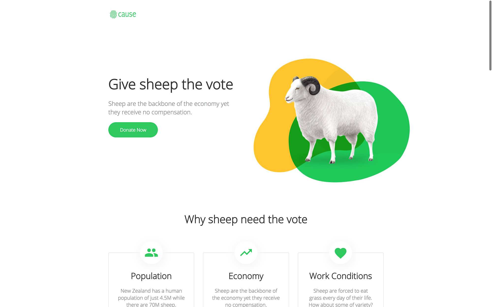

# Cause

Not for profit themed template for Jekyll. Browse through a [live demo](https://spiffy-door.cloudvent.net/).
Increase the web presence of a not for profit or cause website with this configurable theme.

Cause was made by [CloudCannon](http://cloudcannon.com/), the Cloud CMS for Jekyll and Hugo.
The component library is built and maintained for use with [Bookshop](https://github.com/cloudcannon/bookshop/)

Find more templates, themes and step-by-step Jekyll tutorials at [CloudCannon Community](https://cloudcannon.com/community/).

## Features

* Easy theme switching
* Customisable themes
* Live editing with [CloudCannon](http://cloudcannon.com/)
* Component library for website building
* Dark mode
* Fully configurable Website
* Pre-built pages
* Pre-styled components
* Optimised for editing in [CloudCannon](http://cloudcannon.com/)
* Search engine optimisation
* [Donorbox](https://donorbox.org/)

## Setup

1. Open *Website Settings > General Settings*
2. Add your website name and live domain URL
3. Add an author to the Staff Members collection
4. Build and adjust your website locally, or with live visual editing on [CloudCannon](https://app.cloudcannon.com/)
5. Add any remaining options to *Website Settings > General Settings* if required

## Develop

Cause was built with [Jekyll](http://jekyllrb.com/) version 4.2.0, but should support newer versions as well.

Install the dependencies for Bookshop:

~~~bash
$ npm install
~~~

Install the Jekyll dependencies with [Bundler](http://bundler.io/):

~~~bash
$ cd site
$ bundle install
~~~

Run the website:

~~~bash
$ cd ../
$ npm start
~~~

## Editing

Cause is already optimised for adding, updating and removing pages, and components in CloudCannon.

### Posts

* Add, update or remove a post in the *Posts* collection.
* The **Staff Author** field links to members in the **Staff Members** collection.
* Change the defaults when new posts are created in `_posts/_defaults.md`.

## Collections
* When adding or removing collections, update the Explore View options within the `_config.yml` file. For more information see CloudCannon's documentation on [Explore Groups](https://cloudcannon.com/documentation/edit/interfaces/explore/#keyword:_explore).

### Contact Forms

* Preconfigured to work with CloudCannon, but easily changed to another provider (e.g. [FormSpree](https://formspree.io/)).
* Sends email to the address defined within the component.

### Staff

* Reused around the site to save multiple editing locations.

### Navigation

* Managed as a data file to give clients better access.
* Set in the *Website Settings > Navigation* section.

### Footer

* Managed as a data file to give clients better access.
* Set in the *Website Settings > Footer* section.
